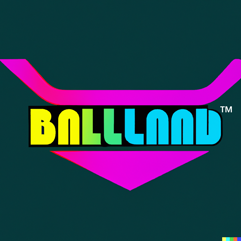

# BadLang™ - The future of programming

[](https://docs.rs/badlang)
[](https://crates.io/crates/badlang)
[](https://github.com/gianzellweger/badlang)
[](https://github.com/gianzellweger/badlang)
[](https://crates.io/crates/badlang)
[](https://youtu.be/dQw4w9WgXcQ)
[](https://actions-badge.atrox.dev/gianzellweger/badlang/goto?ref=release)




This language isn't just the next trend - it's the future. You've heard of "Rewrite it in Rust". Soon you will hear "Rewrite it in BadLang™" (The ™ is pronounced).

This language features the newest paradigm: Stack-based programming. You've heard of imperative, you've heard of functional, but have you heard of stack-based? It was established in 1970 by the Forth language, so probably not.

## Examples

### Basic example

This programming language is stack based:
```
69 drop
```
This revolutionary blazingly fast example shows the grace of stack-based programming.

---

### Hello world

See [this file](https://github.com/gianzellweger/badlang/blob/release/examples/hello.bl).

---

### Addition

Addition is where this programming language really shines! We can add two, even three numbers! Bet your C can't do that!
```
34 35 + print
```
Or with three numbers:
```
20 23 26 + + print
```

---

### Comments

You can start a comment using `coment` and stop it using `no_coment`.

## Contributing

If you want to contribute, you can either do so [financially](https://www.youtube.com/watch?v=dQw4w9WgXcQ) or read the [Contributing Guidelines](CONTRIBUTING.md)

## Etymology

The name "BadLang™" actually stands for "Badass Language", because that's what it is.
